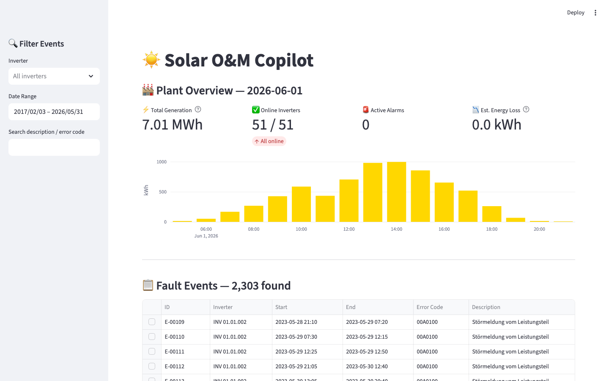
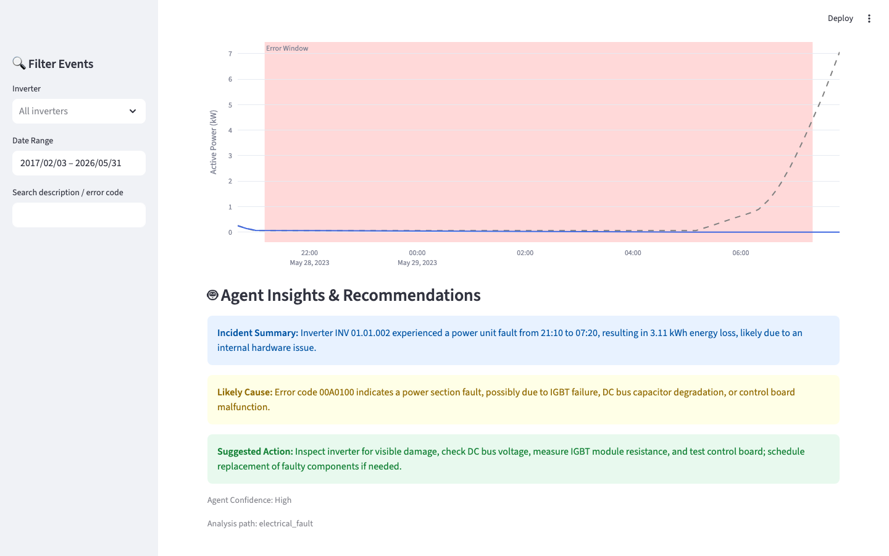
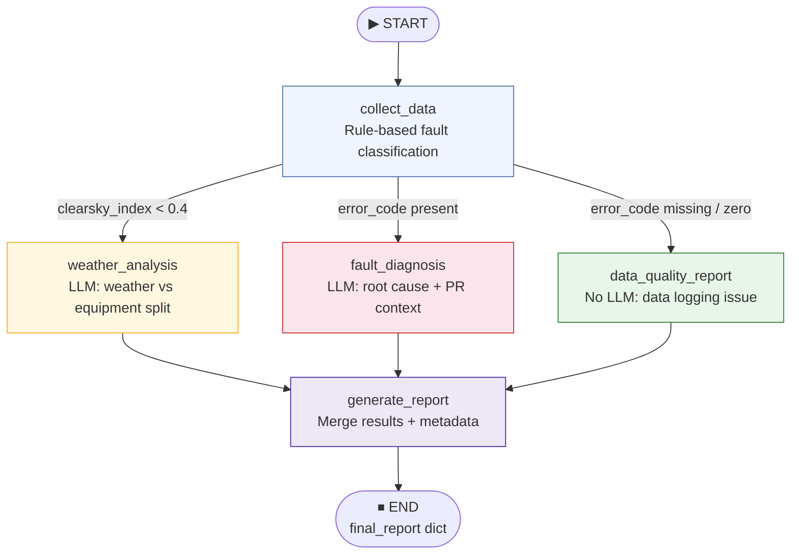

# Solar O&M Copilot MVP

Streamlit-based web application that connects minute-resolution inverter telemetry, error codes, and service tickets to help O&M teams quickly identify inverter failures, calculate production impact, and get actionable advice via a LangGraph-powered agent.

## Demo

## Screenshots

**Plant Overview & Fault Event Table**

**AI Agent Insights (LangGraph `electrical_fault` path)**

## Agent Workflow

The agent uses a **LangGraph `StateGraph`** to route each fault event through a dedicated analysis path instead of a single generic LLM call.

| Node | Trigger condition | LLM call |
|---|---|---|
| `collect_data` | always (entry point) | No — pure rule logic |
| `weather_analysis` | clear-sky index < 0.4 | Yes — weather/equipment split prompt |
| `fault_diagnosis` | error code present | Yes — root-cause prompt with PR & CSI context |
| `data_quality_report` | error code missing or `0000000` | No — static response |
| `generate_report` | always (exit node) | No — merges results + adds metadata |

The routing decision (`workflow_path`) is surfaced in the UI so evaluators can see which branch fired.

## Project Structure
- `data/`: Place your raw CSV files here (`telemetry_minute.csv`, `error_events.csv`, `service_tickets.csv`).
- `src/`:
  - `data_pipeline.py`: Initializes DuckDB, loads CSVs, and creates wide tables.
  - `analytics_engine.py`: DuckDB queries for power loss, IEC 61724 Performance Ratio, and pvlib clear-sky index.
  - `agent_core.py`: LangGraph `StateGraph` with 5 nodes; uses DeepSeek API (OpenAI-compatible).
- `app.py`: Streamlit frontend.
- `requirements.txt`: Python dependencies.

## Quick Start
1. Install dependencies: `pip install -r requirements.txt`
2. Set your DeepSeek API key: `export DEEPSEEK_API_KEY='your-key-here'`
3. Place your data in the `data/` folder.
4. Run the app: `streamlit run app.py`

## Features
- **Plant Overview Dashboard**: Daily generation (MWh), online inverter count, active alarms, and estimated energy loss at a glance.
- **Impact Calculation**: Compares an inverter's actual power against a peer baseline to estimate lost kWh during a fault event.
- **IEC 61724 Performance Ratio**: Standard PR plus weather-corrected PR (pvlib clear-sky GHI normalization).
- **Weather Context**: Clear-sky index chart (measured vs pvlib baseline) to distinguish weather-driven losses from equipment faults.
- **Multi-step Agent**: LangGraph workflow routes each event to the right analysis path and surfaces the routing decision in the UI.
